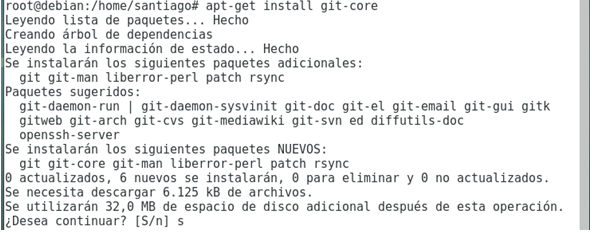

# Parcial 1

**Nombre:** Santiago Fajardo  
**Código:** A00328044  
**Curso:** Sistemas Operativos  
**Correo:** santiago_fajardo96@hotmail.com

## Descripción
En este repositorio encontrarás el parcial 1, en donde se instala una imagen del sistema operativo Debian en virtual box, además la configuración de PuttyTabs.

## Punto 3 

### Descarga y Verificacion
1. Se descarga [MD5](http://download.cnet.com/MD5-SHA-Checksum-Utility/3001-2092_4-10911445.html) para realizar la verificacion del cheksum.
2. Se ingresa a [aqui](http://cdimage.debian.org/debian-cd/current/amd64/iso-cd/MD5SUMS) para obtener el checksum que debemos verificar (corresponde al primero de los tres).
3. Se ingresa en el campo correspondiente y se verifica.  


## Punto 4

### Instalación
1. Abrir virtual box
2. Oprimir Nueva
3. Nombre --> Debian (lo demas cambia automaticamente9
4. Seleccionar tamaño de memoria (1024 MB)
5. Crear un disco virtual ahora
6. VDI
7. Reservado dinámicamente
8. Tamaño del archivo (8 GB)
9. Configruración de la maquina
10. Red / Adaptador 2 / Habilitar adapador de red / Conectado a Adaptador puente
11. Almacenamiento / Controlador / Unidad Optica / Seleccionar imagen descargada
12. Aceptar (maquina creada)
13. Correr la maquina y seguir la configuracion guiada

### Información del sistema

```
uname Muestra información del sistema
```


```
uname -s Muestra el nombre del sistema.
```

```
uname -n Muestra el nombre por el que se identifica el sistema en la red (el FQDN)
```

```
uname -a Muestra toda la información sobre el tipo de sistema que se esta utilizando.
```

```
uname -m Muestra el tipo de arquitectura que se esta utilizando.
```

```
uname -r Muestra información sobre el kernel.
```

```
uname -v Muestra información sobre la versión del Sistema Operativo.
```

```
uname -p Muestra información sobre el procesador.
```


## Punto 5

### Instalación de putty

1. Descargar putty [64 bits](https://the.earth.li/~sgtatham/putty/latest/w64/putty.exe)  o [32 bits](https://the.earth.li/~sgtatham/putty/latest/w32/putty.exe) 
2. Descargar [MTPuTTY](http://ttyplus.com/download/mtputty.exe)
3. Correr MTPuTTY
4. Server / Add server
5. En virtual box correr el comando **ip a**
6. La ip obtenida será el server name
7. SSH
8. Port --> 22
9. username (el mismo con que se configuró la maquina virtual)
10 password (la que se escribio en la configuración)
11. Correrla darle si (Termino la configuración)

## Punto 6

### Paso 1 (apt-get update)

### Paso 2 (apt-get upgrade)

### Paso 3 (apt-get git-core)



### Paso 4 (apt-get install tig)


### Evidencia de tig


## Punto 7 

(realizar en sala de computo)

## Punto 8


## Diferencias y similitudes Centos vs Debian

### Similitudes
- Equipos de sobremesa
- Compatibles con instalaciones de servidor minimas

### Diferencias

#### Centos
- Clon de una de las distribuciones comerciales mas estables
- Estable, dificil que te de problemas
- Facil instalacion de sofware especifico que no esta diseñado para debian
- Respaldo de RED HAT
- Compatibilidad con los bianrios de las aplicaciones desarrolladas para RHEL
- No se ejecuta en tantas arquitecturas
- Cuota del mercado 20,4%
- Falta apoyo de la comunidad
- Preferido por empresas


#### Debian
- Distribucion libre, manejada por la comunidad
- Mas estable de GNU/Linux
- Disponibilidad de versiones mas recientes
- Sin acceso al servidor
- Actualizaciones se haran via ssh
- Tiene mas paquetes, 52000 paquetes y pueden haber mas
- Contaccion social
- Mayor cantidad de usuarios en el servidor
- Ultima version Debian 9
- 31.9% del mercado
- Se considera para expertos de linux

